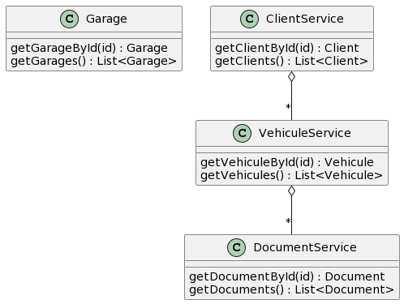

**DOCKER-COMPOSE**

Dans un terminal, à la racine du projet, lancer la commande "docker compose up -d"

Les microservices de cette application sont :
- garage
- client
- véhicule 
- document 

**BACKEND**

Les adresses atteignables des services sont (pour le moment) directement accessibles à : 
- http://localhost:8081/garages
- http://localhost:8082/clients
- http://localhost:8083/vehicules
- http://localhost:8084/documents
- http://loalhost:9999/application/default 
- http://localhost:8761 
Les services sont egalement accessibles via la gateway aux adresses suivantes : 
- http://localhost:8888/GARAGE-SERVICE/garages
- http://localhost:8888/CLIENT-SERVICE/clients
- http://localhost:8888/VEHICULE-SERVICE/vehicules
- http://localhost:8888/DOCUMENT-SERVICE/documents

Les services sont testables avec swagger : 
- http://swagger-ui/index.html 

# diagram
@startuml
class Garage {
getGarageById(id) : Garage
getGarages() : List<Garage>
}

class ClientService {
getClientById(id) : Client
getClients() : List<Client>
}
class VehiculeService {
getVehiculeById(id) : Vehicule
getVehicules() : List<Vehicule>
}
class DocumentService{
getDocumentById(id) : Document
getDocuments() : List<Document>
}
ClientService o-- "*" VehiculeService

VehiculeService o-- "*" DocumentService
@enduml

**FRONTEND** 

